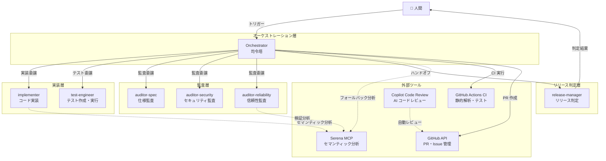
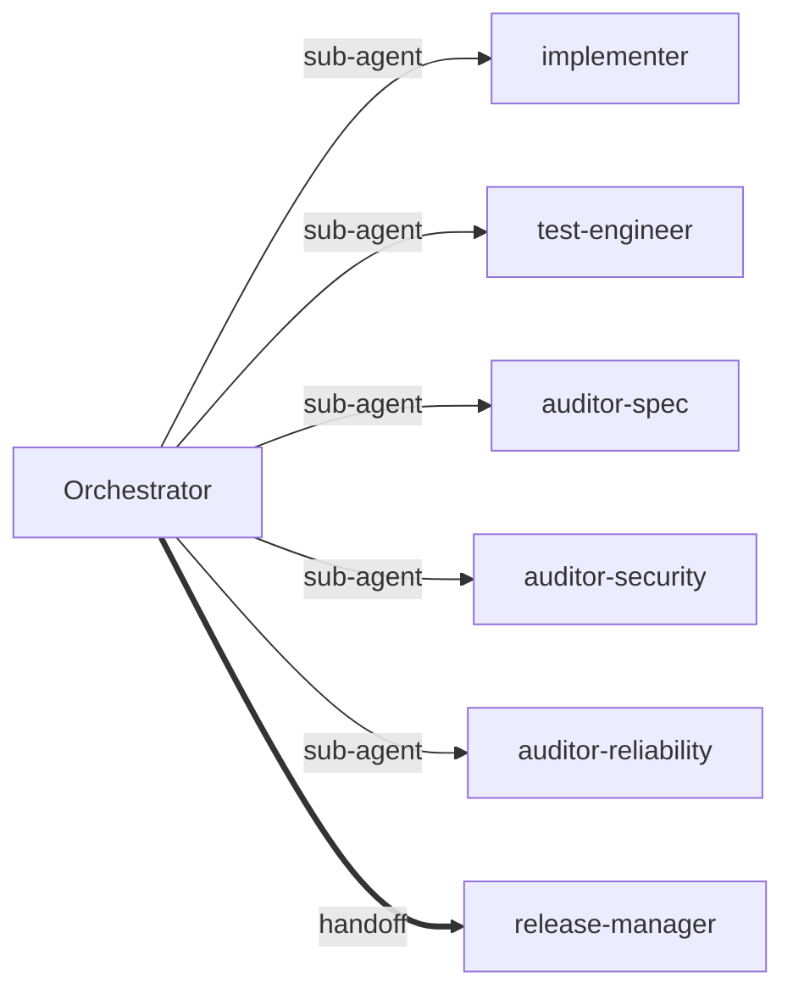
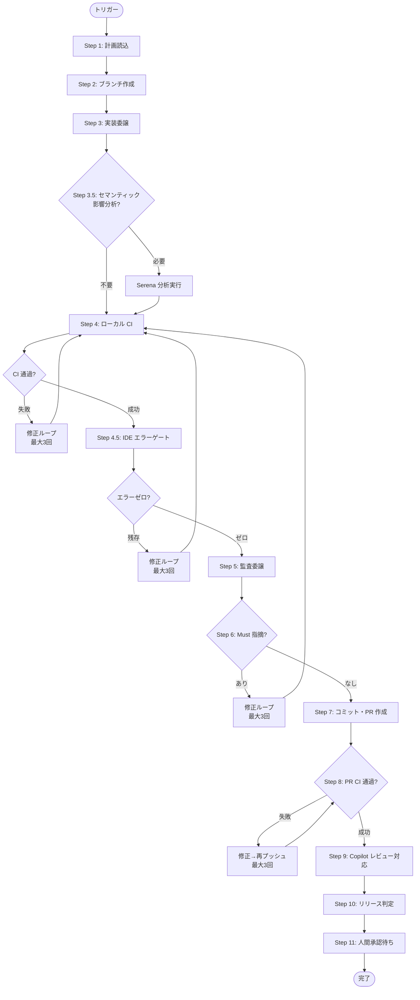
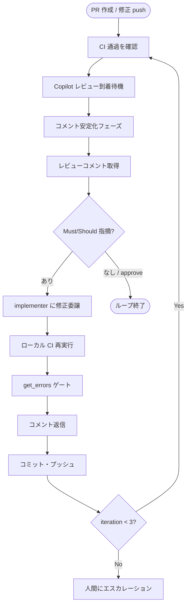

# オーケストレーション構成ドキュメント

> 本ドキュメントは、AI エージェントパイプラインの全体設計・構成・運用を一元的に管理するテンプレートである。
> プロジェクト固有の内容は `<!-- PROJECT: ... -->` コメントで示す。
> 実際のプロジェクトに適用する際は、これらのプレースホルダーを置き換えること。

## 目次

1. [全体アーキテクチャ](#1-全体アーキテクチャ)
2. [エージェント一覧](#2-エージェント一覧)
3. [パイプラインフロー](#3-パイプラインフロー)
4. [Serena MCP 統合](#4-serena-mcp-統合)
5. [Copilot コードレビュー統合](#5-copilot-コードレビュー統合)
6. [CI/CD パイプライン](#6-cicd-パイプライン)
7. [AI モデル構成](#7-ai-モデル構成)
8. [構成ファイル一覧](#8-構成ファイル一覧)
9. [運用手順](#9-運用手順)
10. [変更履歴](#10-変更履歴)

---

## 1. 全体アーキテクチャ

### 1.1 設計思想

本システムは **エージェント指向のソフトウェア開発パイプライン** を採用している。
人間の開発者が計画を承認し、AI エージェント群が自律的に実装・テスト・監査・リリース判定を行う。

主要な設計原則：

- **関心の分離**: 各エージェントは単一の責務を持つ
- **独立監査**: 監査エージェントは実装エージェントとは独立して判断する
- **フェイルクローズ**: 不確実な場合は安全側に倒す（P-010）
- **Human-in-the-loop**: 最終マージ判断は人間が行う
- **Bounded Recursion**: 修正ループには回数上限（最大3回）を設ける

### 1.2 システム構成図



### 1.3 動作モード

| モード | トリガーフレーズ | 内容 |
|---|---|---|
| 自動実行 | 「計画に従い作業を実施して」「Next を実行して」等 | plan.md の Next タスクを自律実行 |
| 計画修正 | 「計画を修正して」「Issue を追加して」等 | plan.md / GitHub Issues / Project を更新 |
| 汎用リクエスト | 上記以外 | 改善提案・調査・リファクタリング等 |
| モデル最適化 | 「モデルを最適化して」「モデルを見直して」等 | AI モデル割当の提案・変更 |

---

## 2. エージェント一覧

### 2.1 エージェント定義サマリ

| エージェント | ファイル | 責務 | 呼出可能 | MCP |
|---|---|---|---|---|
| Orchestrator | `orchestrator.agent.md` | パイプライン全体の指揮・統合 | ✅ | ✅ |
| implementer | `implementer.agent.md` | コード実装・docs 更新 | ❌ | ✅ |
| test-engineer | `test-engineer.agent.md` | テスト作成・実行 | ❌ | ❌ |
| auditor-spec | `auditor-spec.agent.md` | 仕様整合性の監査 | ❌ | ❌ |
| auditor-security | `auditor-security.agent.md` | セキュリティ監査 | ❌ | ❌ |
| auditor-reliability | `auditor-reliability.agent.md` | 信頼性・テスト品質監査 | ❌ | ✅ |
| release-manager | `release-manager.agent.md` | リリース可否の最終判定 | ✅ | ❌ |

### 2.2 ツールマトリクス

| ツール | Orch | Impl | Test | A-Spec | A-Sec | A-Rel | RM |
|---|---|---|---|---|---|---|---|
| agent | ✅ | - | - | - | - | - | - |
| read | ✅ | ✅ | ✅ | ✅ | ✅ | ✅ | ✅ |
| editFiles | ✅ | ✅ | ✅ | - | - | - | - |
| runInTerminal | ✅ | ✅ | ✅ | - | - | - | ✅ |
| search | ✅ | ✅ | ✅ | ✅ | ✅ | ✅ | ✅ |
| search/usages | - | - | - | ✅ | ✅ | ✅ | - |
| web/fetch | ✅ | - | - | ✅ | - | - | ✅ |
| web/githubRepo | ✅ | - | - | - | - | - | ✅ |
| mcp (Serena) | ✅ | ✅ | - | - | - | ✅ | - |

### 2.3 エージェント連携（委譲関係）



- **sub-agent**: Orchestrator が呼び出し、結果を受け取る（制御は Orchestrator に戻る）
- **handoff**: Orchestrator が制御ごと引き渡す（release-manager が最終判定を行う）

### 2.4 各エージェントの詳細

#### Orchestrator

- **責務**: パイプライン全体の指揮。タスク分解、エージェント委譲、結果統合。**自らコードは書かない。**
- **サブエージェント**: implementer, test-engineer, auditor-spec, auditor-security, auditor-reliability
- **ハンドオフ先**: release-manager
- **制約**: Next 以外のタスクに着手しない / Backlog を勝手に開始しない / ポリシー違反検出時は即停止

#### implementer

- **責務**: ソースコードの実装と `docs/` の更新
- **制約**: P-001（禁止操作）/ P-002（秘密情報禁止）を厳守
- **Serena 利用**: Shift-Left で実装前・中・後にセマンティック分析を実施（第1層）

#### test-engineer

- **責務**: 単体テスト / 境界値テスト / 統合テスト / 再現性テストの作成・実行
- **制約**: ダミーデータのみ使用 / 実データ禁止

#### auditor-spec

- **責務**: `requirements.md` / `policies.md` / `constraints.md` との整合性を独立監査
- **出力**: Must / Should / Nice に分類された指摘リスト

#### auditor-security

- **責務**: P-001（禁止操作）/ P-002（秘密情報禁止）/ P-040（依存関係）の監査
- **特徴**: 最も制限されたツールセット（editFiles / runInTerminal なし）

#### auditor-reliability

- **責務**: 再現性（NFR-001）/ テスト品質（NFR-020）/ エラーハンドリング（P-010）の監査
- **Serena 利用**: Stage 3 で条件付きセマンティック検証（第3層）

#### release-manager

- **責務**: 全監査結果を統合し、受入条件（AC）をチェックして PR のマージ可否を判定
- **制約**: コードを変更しない / 最終マージは人間が行う

---

## 3. パイプラインフロー

### 3.1 自動実行パイプライン全体像



### 3.2 各ステップの詳細

<!-- PROJECT: CI コマンドはプロジェクトのツールチェインに合わせて変更すること -->

#### Step 1: 計画読込

- `docs/plan.md` の Next セクション先頭タスクを選択
- 起動時読込ファイル: `docs/plan.md`, `docs/requirements.md`, `docs/policies.md`, `docs/constraints.md`, `docs/architecture.md`

#### Step 2: ブランチ作成

- `feat/<タスクID>-<説明>` 形式のフィーチャーブランチを作成

#### Step 3: 実装委譲

- **implementer** にコード実装を委譲
- **test-engineer** にテスト作成を委譲
- implementer は Serena MCP を活用して Shift-Left 分析を実施（§4 参照）

#### Step 3.5: セマンティック影響分析（条件付き）

- **条件**: `src/` の公開 API / シグネチャが変更された場合
- **実行**: Orchestrator が Serena MCP で影響分析を実行
- **目的**: implementer が未実施の場合のフォールバック

#### Step 4: ローカル CI

<!-- PROJECT: CI コマンドはプロジェクトに合わせて変更 -->

失敗時は implementer に修正を指示し、最大3回ループ。

#### Step 4.5: IDE エラーゲート

- `get_errors` ツール（filePaths 省略）でワークスペース全体のエラーを取得
- **エラーがゼロになるまで Step 5 に進まない**

#### Step 5: 監査委譲

3つの監査エージェントに並行して委譲。

#### Step 6: 修正ループ

- Must 指摘が 1 件以上 → implementer に修正指示 → Step 4 から再実行
- 最大3回のループで解決しない場合は停止

#### Step 7: コミット・プッシュ・PR 作成

- Conventional Commit フォーマットでコミット
- PR 本文は `--body-file` で一時ファイル経由（`--body` は禁止）
- PR 本文に `Closes #XX` を記載

#### Step 8: PR CI 検証

- `gh pr checks <PR番号> --watch` で CI 結果を監視
- 失敗時は修正 → 再プッシュ（最大3回）

#### Step 9: Copilot コードレビュー対応ループ

§5 で詳述。最大3回のイテレーション。

#### Step 10: リリース判定

- **release-manager** にハンドオフ
- 承認された場合、「マージ可能」と人間に報告

#### Step 11: 人間承認待ち

- **人間の最終承認なしにマージは実行しない**（自動マージ禁止）

### 3.3 停止条件

- ポリシー違反（P-001〜P-003）の検出
- 修正ループが3回を超えた
- サブエージェントから解決不能なエラーが報告された
- `docs/plan.md` の Next が空

---

## 4. Serena MCP 統合

### 4.1 概要

Serena MCP はセマンティックなコード理解（シンボル検索、参照元追跡、構造把握）を提供するツールサーバーである。
**Shift-Left + ターゲット分析** アプローチを採用し、3層で統合する。

### 4.2 接続構成

```jsonc
// .vscode/mcp.json
{
  "servers": {
    "serena": {
      "command": "uvx",
      "args": [
        "--from", "git+https://github.com/oraios/serena",
        "serena", "start-mcp-server",
        "--context", "ide-assistant",
        "--project", "${workspaceFolder}"
      ],
      "type": "stdio"
    }
  }
}
```

### 4.3 3層統合モデル

| 層 | エージェント | タイミング | 目的 |
|---|---|---|---|
| 第1層（主要） | implementer | 実装前・中・後 | コード構造把握、参照元チェック、変更整合性確認 |
| 第2層（補完） | Orchestrator | Step 3.5 | implementer 未実施時のフォールバック影響分析 |
| 第3層（検証） | auditor-reliability | Stage 3 | 前段分析結果のスポットチェック or フォールバックフル分析 |

### 4.4 条件付き実行ルール

| 変更種別 | Serena 実行 |
|---|---|
| `src/` の公開 API / シグネチャ変更 | **必須** |
| `src/` の内部ロジック変更 | 推奨 |
| テスト / docs / config のみ | スキップ |
| MCP 利用不可 | スキップ（従来の方法で代替） |

---

## 5. Copilot コードレビュー統合

### 5.1 設計原則

| # | 原則 | 説明 |
|---|---|---|
| 1 | Push 型アーキテクチャ | push だけでレビューをトリガー |
| 2 | Bounded Recursion | 最大3回のイテレーションでループ制限 |
| 3 | 静的解析ファースト | AI レビュー前に CI + get_errors を必ず通過させる |
| 4 | CI ≠ レビュー | CI 通過とレビュー完了は独立事象として扱う |

### 5.2 前提条件

1. **Ruleset: Review new pushes** — リポジトリ設定で有効にする
2. **GitHub App Token / PAT でのプッシュ** — `GITHUB_TOKEN` では Copilot が発火しない

### 5.3 レビュー対応フロー



### 5.4 指摘の分類

| 分類 | 対応 |
|---|---|
| **Must** | マージ前に修正必須 |
| **Should** | 強く推奨（時間が許せば修正） |
| **Nice** | 今回はスキップ可 |

---

## 6. CI/CD パイプライン

<!-- PROJECT: CI ワークフローとコマンドはプロジェクト固有の設定に合わせる -->

### 6.1 GitHub Actions ワークフロー

ファイル: `.github/workflows/ci.yml`

### 6.2 セキュリティ制約

- `permissions` は必要最小限を明示的に指定
- `permissions: write-all` は禁止
- サードパーティ Action はコミットハッシュで固定（タグ指定は禁止）

---

## 7. AI モデル構成

### 7.1 現在の設定

設定ファイル: `configs/ai_models.toml`

<!-- PROJECT: 現在のモデル設定を記載 -->

### 7.2 利用可能なモデル一覧（2025年7月時点）

#### 無料（0x）

| モデル | 特徴 |
|---|---|
| GPT-4.1 | OpenAI の汎用モデル |
| GPT-5 mini | 軽量版 GPT-5 |
| Raptor mini | 軽量推論モデル |

#### 低コスト（0.25x〜0.33x）

| モデル | 倍率 | 特徴 |
|---|---|---|
| Grok Code Fast 1 | 0.25x | xAI のコード特化高速モデル |
| Claude Haiku 4.5 | 0.33x | Anthropic の最軽量モデル |
| Gemini 3 Flash | 0.33x | Google の高速モデル |
| GPT-5.1-Codex-Mini | 0.33x | OpenAI のコード特化軽量モデル |

#### スタンダード（1x）

| モデル | 特徴 | 主要ベンチマーク |
|---|---|---|
| **Claude Sonnet 4.6** | **エージェントタスク最強** | SWE-bench 79.6%, TerminalBench 53% (#1) |
| Claude Sonnet 4.5 | 安定した前世代モデル | SWE-bench 70.3% |
| GPT-5.2 | 総合力トップクラス | SWE-bench 80.0%, GPQA Diamond 92.4% |

#### プレミアム（3x）

| モデル | 特徴 | 主要ベンチマーク |
|---|---|---|
| **Claude Opus 4.6** | **深い推論・最高品質** | SWE-bench ~80.8%, GPQA Diamond 91.3% |

### 7.3 モデル変更手順

1. `configs/ai_models.toml` の `[ai_models.overrides]` セクションを編集
2. `bash scripts/update_agent_models.sh` を実行
3. 変更をコミット・プッシュ

---

## 8. 構成ファイル一覧

### 8.1 エージェント定義

| ファイル | 内容 |
|---|---|
| `.github/agents/orchestrator.agent.md` | Orchestrator 定義 |
| `.github/agents/implementer.agent.md` | implementer 定義 |
| `.github/agents/test-engineer.agent.md` | test-engineer 定義 |
| `.github/agents/auditor-spec.agent.md` | 仕様監査定義 |
| `.github/agents/auditor-security.agent.md` | セキュリティ監査定義 |
| `.github/agents/auditor-reliability.agent.md` | 信頼性監査定義 |
| `.github/agents/release-manager.agent.md` | リリース判定定義 |

### 8.2 設定ファイル

| ファイル | 内容 |
|---|---|
| `configs/ai_models.toml` | モデル割当の正本 |
| `scripts/update_agent_models.sh` | toml → agent ファイルへの一括反映 |
| `.github/copilot-instructions.md` | リポジトリ全体の Copilot 指示 |
| `.github/copilot-code-review-instructions.md` | Copilot Code Review 設定 |
| `.vscode/mcp.json` | MCP サーバー接続設定 |
| `.serena/project.yml` | Serena プロジェクト設定 |

### 8.3 正本ドキュメント

| ファイル | 内容 |
|---|---|
| `docs/plan.md` | 計画（ロードマップ、Next、Backlog、Done） |
| `docs/requirements.md` | 要件定義 |
| `docs/policies.md` | ポリシー一覧 |
| `docs/constraints.md` | 制約仕様 |
| `docs/architecture.md` | アーキテクチャ |
| `docs/runbook.md` | 運用手順 |
| `docs/adr/` | アーキテクチャ決定記録 |

---

## 9. 運用手順

### 9.1 新規エージェントの追加

1. `.github/agents/<name>.agent.md` を作成
2. `configs/ai_models.toml` にエントリを追加（任意）
3. Orchestrator の `agents:` リストに追加
4. `copilot-instructions.md` を更新
5. 本ドキュメントを更新

### 9.2 モデル変更

1. `configs/ai_models.toml` を編集
2. `bash scripts/update_agent_models.sh` を実行
3. 変更をコミット・プッシュ
4. 本ドキュメントの §7.1 を更新

---

## 10. 変更履歴

| 日付 | 内容 |
|---|---|
| 2025-07-17 | テンプレート初版作成。 |
